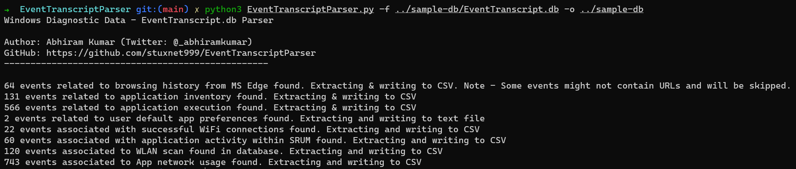

# EventTransScriptParser

**EventTranscriptParser** is python based tool to extract forensically useful details from EventTranscript.db (Windows Diagnostic Database).

The database is found in Windows 10 systems and present at `C:\ProgramData\Microsoft\Diagnosis\EventTranscript\EventTranscript.db`.

The tool currently supports the following features.

+ Extracting MS Edge browser history.
+ Extracting list of software/programs installed on the host system.
+ Extracting Wireless Scan results.
+ Extracting WiFi connection details (SSIDs, device manufacturers etc...)
+ Extracting Physcial Disk information (Disk size, No. of partitions etc...)
+ Extracting PnP device installation information (Install time, Model, Manufacturer etc...)
+ MORE COMING SOON!!

### Requirements

Python 3.8 or above. Older version of Python 3.x should work fine as well.

#### Dependencies

These are the required libraries/modules needed to run the script
+ json
+ sqlite3
+ pandas
+ os
+ argparse

### Usage

The tool is completely CLI based.

```python
python EventTranscriptParser.py -f <Path-To-EventTranscript.db>
```

**Tip**: Before running the tool against the database, make sure that the **-wal (Write Ahead Log)** file data is merged with the original database. Because you might miss out on crucial/juicy data.



### Acknowledgements

This tool wouldn't have been possible without the excellent research & hardwork put in by my colleagues [Andrew Rathbun](https://twitter.com/bunsofwrath12) & [Josh Mitchell](https://www.linkedin.com/in/josh-mitchell-0990ba6a/) in investigating the Windows Diagnostic Data.

Read more about their research here - https://github.com/rathbuna/EventTranscript.db-Research

### Author

Abhiram Kumar

+ Twitter: [@_abhiramkumar](https://www.twitter.com/_abhiramkumar)
+ Personal blog: https://stuxnet999.github.io