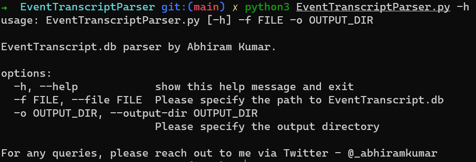

### About

**EventTranscriptParser** is python based tool to extract forensically useful details from EventTranscript.db (Windows Diagnostic Database).

The database is found in Windows 10 systems and present at `C:\ProgramData\Microsoft\Diagnosis\EventTranscript\EventTranscript.db`.

The tool currently supports the following features.

+ Extracting MS Edge browser history.
+ Extracting list of software/programs installed on the host system.
+ Extracting Wireless Scan results.
+ Extracting WiFi connection details (SSIDs, device manufacturers etc...)
+ Extracting Physical Disk information (Disk size, No. of partitions etc...)
+ Extracting PnP device installation information (Install time, Model, Manufacturer etc...)
+ MORE COMING SOON!!

### Requirements

Python 3.8 or above. The older versions of Python 3.x should work fine as well.

#### Dependencies

These are the required python libraries/modules needed to run the script
+ json
+ sqlite3
+ pandas
+ os
+ argparse

All the above modules are available by default in python3 except **Pandas**.

To install pandas, use `pip` via command prompt/terminal.

```sh
pip install pandas
```

### Usage

**Tip**: Before running the tool against the database, make sure that the **-wal (Write Ahead Log)** file data is merged with the original database. Because you might miss out on crucial/juicy data.

The tool is completely CLI based and there are 2 ways to use it.

#### Using Python

```python
python EventTranscriptParser.py -f <Path-To-EventTranscript.db> -o <Path-To-Output-Directory>
```


To view help,
```
python EventTranscriptParser.py -h
```



#### Using Executable

If you do not have python pre-installed in you system or have issues with the running the script, you can use the compiled executable. The executable is also CLI based.

Download the executable from https://github.com/stuxnet999/EventTranscriptParser/releases

```sh
.\EventTranscriptParser.exe -f .\EventTranscript.db -o .\CSV-Output\
```


The executable was compiled using `pyinstaller` version **4.5.1**.

#### Compiling on your own

If you wish to compile on your own, use the commands below in any command prompt/terminal window.

```sh
pip install pyinstaller
pyinstaller --onefile EventTranscriptParser.py
```

You will find the compiled executable in the `dist` directory.

### Acknowledgements

This tool wouldn't have been possible without the excellent research & hard work put in by my colleagues [Andrew Rathbun](https://twitter.com/bunsofwrath12) & [Josh Mitchell](https://www.linkedin.com/in/josh-mitchell-0990ba6a/) in investigating the Windows Diagnostic Data.

Read more about their research here - https://github.com/rathbuna/EventTranscript.db-Research

Follow the investigative series at Kroll on EventTranscript.db - https://www.kroll.com/en/insights/publications/cyber/forensically-unpacking-eventtranscript

### Author

Abhiram Kumar

+ Twitter: [@_abhiramkumar](https://www.twitter.com/_abhiramkumar)
+ Personal blog: https://stuxnet999.github.io